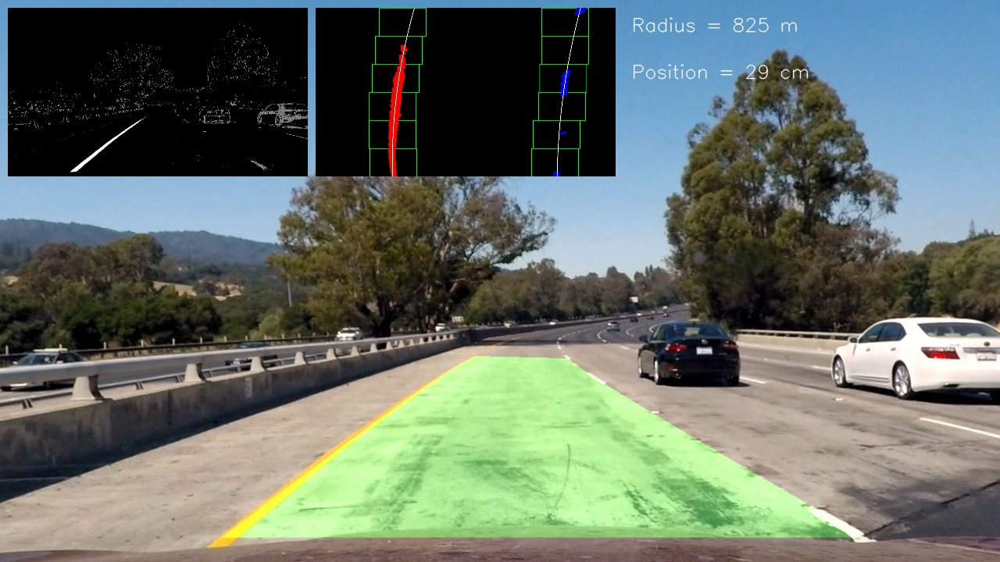
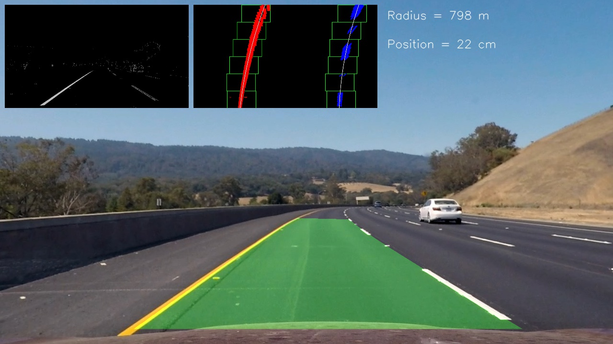

## Project 2: Advanced Lane Finding

---

* This is project 2 of the Udacity Self-Driving-Car Nanodegree.
* The project covers several computer vision techniques, e.g.
⋅⋅⋅ Camera calibration
⋅⋅⋅ Color transformation (HSL, CMYK)
⋅⋅⋅ Gradient thresholding
⋅⋅⋅ Perspective transformation

[All the code and the writeup information can be found in this Jupyter Notebook.](P2_AdvancedLaneFinding.ipynb)

---

Check out the results in the final video:

